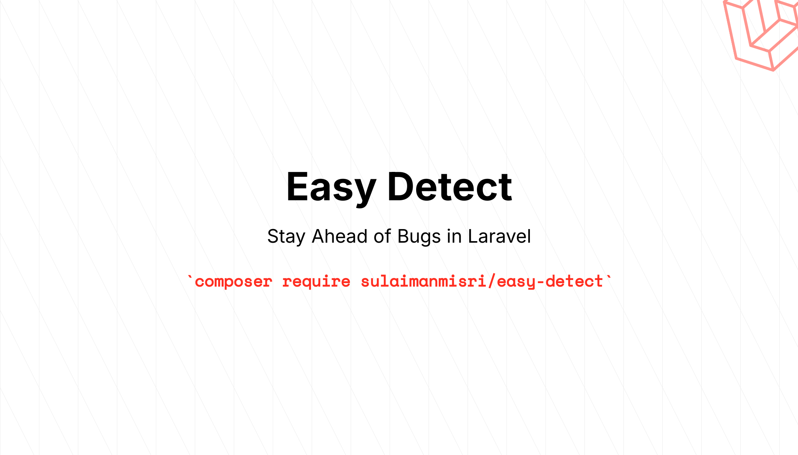

## Easy Detect - Laravel Error Notification Package
Easy Detect is a Laravel package designed to simplify error monitoring in your application. It automatically sends email notifications whenever an exception occurs, providing detailed error reports to help you quickly identify and resolve issues.

## About the Author
Hi, I'm Sulaiman Misri. Currently I'm working as a Senior Executive in Kuala Lumpur Malaysia. If you find this package useful, feel free to check out my [portfolio](https://sulaimanmisri.com) for more information about my freelance services.

## Pre-requisites
* Laravel 10.x or higher
* PHP 8.1 or higher

## Installation
1. Install the package via Composer
```bash
composer require sulaimanmisri/easy-detect
```

2. Publish the configuration file:
```bash
php artisan vendor:publish --tag=easy-detect-config
```

3. Publish the view file:
```bash
php artisan vendor:publish --tag=easy-detect-views
```

4. Update your .env file with the recipients email. You can set more than one recipients.
```bash
EASY_DETECT_RECIPIENTS="userone@email.com, usertwo@email.com"
```

5. Configure your mail settings in .env (e.g., SMTP credentials)

> [!IMPORTANT]
> You must set your `QUEUE_CONNECTION` to `database` in order to send the email in background process. This ensures your application remains responsive while error notifications are being processed. Using database queue also provides better reliability and allows for failed job handling.

## Usage
1. You can turn `ON` or `OFF` the mailing report by changing the value of `turn_on` inside the `easy-detect` config file.
```
'turn_on' => false // this will turn of the mailing report to be send
```

2. Once installed, Easy Detect will automatically send email notifications for unhandled exceptions. No additional code is required! 

> [!IMPORTANT]
> You should always turn off this feature when you are in Local or Staging. Since you can debug it by yourself. But, it is always recomended to turn on this on Production.

## Configuration
The package comes with a configuration file (`config/easy-Detect.php`) where you can customize its behavior.

## Anti Spam mechanism
Since we don't want to received the error mail so many time, you can cache the exception. The idea is to only send to the developer only once in the while. You can set how long it should cache inside the `easy-detect` config file.
```
'cache_duration' => 60, // it will cached for 60 minutes
```

## Customizing the Email Template
To customize the email template, publish the views. But of course, there's some default info stated in there. If you change the contect, you might not see the original Error content. I suggest that you only change the UI/UX and not the default data.


